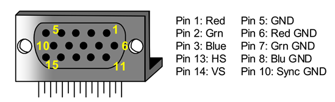

# 华中科技大学2021硬件综合训练

## MIPS CPU设计与俄罗斯方块游戏开发——FPGA上板部分

在Logisim中，我们完成了5段重定向流水线的MIPS CPU设计，支持24条有限常用指令，并添加了中断处理和动态分支预测模块。随后我们基于有限的指令集编写了一个俄罗斯方块游戏程序。俄罗斯方块程序需要相应的键盘输入和显示输出，我们利用Logisim自带键盘和显示屏的逻辑模块，添加了一些额外的电路实现了新的系统调用，支持了俄罗斯方块游戏在Logisim中的I/O需求。至此，我们拥有了一个可以在Logisim中正确执行俄罗斯方块游戏的原型系统。上述系统的设计与验证已在此前文档内容中阐释清楚。

这一部分用于介绍本原型系统的FPGA上板实现，分为三个部分，第一部分讲述VGA接口模块的实现，第二部分讲述基于Vivado自带FIFO IP核的键盘模块实现，第三部分讲述上板联调的注意事项。

本次上板内容已上传至GitHub，请见：[TableOverturn/MIPS_CPU: Staged MIPS CPU design with keyboard support & VGA output.](https://github.com/TableOverturn/MIPS_CPU)

### VGA接口模块实现

#### 概述

首先，我们需要了解视频显示的基本原理。显示器利用人的视觉暂留效应，以超过24帧每秒的速率对显示图像进行刷新，从而产生人眼认为的流畅的视频流信号。典型的显示器工作在60Hz。视频流是由连续的帧组成的，而帧是一行一行刷新得到的。在VGA接口诞生的年代，使用电子枪结合偏转线圈对像素进行刷新的CRT显示器是当时最常见的显示器。下图是一个典型的使用VGA接口提供信号的CRT显示器原理图。


我们将先说明VGA接口的刷新控制，其中包括两个同步信号的定义及产生逻辑，逐行扫描的工作方式以及块映射的实现逻辑；再说明VGA接口的颜色输出方式，包括RGB色彩空间以及Artix-7芯片的VGA输出电路模型。

#### VGA接口的刷新控制

考虑CRT显示器的工作方式，需要以一定的速度横向移动完成一行的刷新，当完成一帧的刷新时，需要让电子枪回到屏幕刷新的起始位置，一般为屏幕左上角；VGA接口规范在制定时，迎合了CRT显示器的部件特性和模拟工作方式。VGA接口本身不输出时钟信号完成控制，而是用**行同步信号**和**场同步信号**来控制电子枪刷新像素的位置。可以将行同步信号理解为一行刷新结束后，跳下一行继续刷新的信号；可以将场同步信号理解为一帧刷新结束后，复位刷新位置，准备刷新下一帧的信号。

我们将这个刷新过程书面定义为**扫描**，扫描可以用两种方式完成，分别是**逐行扫描**和**隔行扫描**。考虑实现的难度，我们在这里使用实现上更简单的逐行扫描方式。顾名思义，逐行扫描即由上而下地一行一行地完成图像扫描过程，扫完所有行时，便扫完了一帧。这里不详细说明隔行扫描的工作方式，感兴趣的同学可以自行了解。下图给出了在行同步信号和场同步信号下，显示器进行**逐行扫描**的工作模式示意图。


实际的VGA规范中，在行列方向上还设计了**显示前沿**和**显示后沿**两段冗余时间，其间给出同步信号。这样做使得视频信号和同步信号在时序上分离，保证二者之间有一定的时间空隙。这一设计的目的有三；第一，电子枪、偏转部件以及相关的电路是实际的物理器件，在发生复位、同步等剧烈变化时，需要留出一定的响应时间；第二，VGA使用全模拟信号输出，而模拟信号的抗干扰能力弱，给信号之间一些相隔的时间，让他们在时序上是非连续的，有利于减少信号的串扰；第三，VGA接口不输出时钟信号，显示器需要通过模拟信号的时间模式判断显示模式，加入间隔提供了一定的时间信息，有利于相关部件对信号进行准确的识别。

这个显示时序如下图所示：


典型的显示器工作在60Hz，这决定了相邻两帧之间刷新的时间间隔是固定的，约16.67ms，本实现中也采用这一工作频率；但显示器还有一个重要的工作指标——分辨率。分辨率定义了显示空间的大小，不难理解，如果刷新一帧的时间固定，而一帧中要刷新的行数量变多了，行同步信号给出的频率也应当更频繁；场同步信号的给出依赖于行刷新过程，一帧中行的数量变多了，场同步信号给出的触发条件也应当需要更高的行计数。这里给出在60Hz频率工作下，800\*600以及640\*480分辨率的时序要求。


本实现中采用640\*480分辨率，根据表格可以得知，刷新一帧需要刷新521行的时间，而刷新一行则占用刷新800个像素的时间；当显示器工作在60Hz时，有：
$$
T_{clk} = \frac {1}{60 * 800 * 521} = 0.04\mu s \\
f_{clk} = \frac {1}{T_{clk}} = 25 MHz
$$
即需要给出一个25MHz的时钟，相关的计数逻辑在vga_counter中给出，用以在时钟驱使下确定行列刷新的位置（包括同步区、前后沿、实际显示区）：

```verilog
module vga_counter (
    input               clk,
    input               rst,
    output reg[9:0]     hcnt,
    output reg[9:0]     vcnt
);
    always @(posedge clk) begin
        if (rst == 1'b0) begin
            hcnt <= 0;
            vcnt <= 0;
        end
        else begin
            if (hcnt < 799)
                hcnt <= hcnt + 1;
            else begin
                hcnt <= 0;
                if (vcnt < 520)
                    vcnt <= vcnt + 1;
                else
                    vcnt <= 0;
            end
        end
    end
endmodule
```

根据这一模块给出的hcnt以及vcnt值，以及表格中的信息，我们可以确定何时产生两个同步信号。本实现中，为节约部件，提高Logisim验证部分的运行速度，使用了尽可能少的存储部件。Logisim中设计出的显示模块分辨率为16\*32，我们将每一个点映射为VGA输出中的一个8\*8的块，得到的实际分辨率为128\*256；我们将这个部分放在了屏幕居中部分，其余显示区域要求显示为纯黑色。为具体说明问题，我们首先给出下面的vga_sync代码：

```verilog
module vga_sync (
    input               clk,
    input               rst,
    input   [9:0]       hcnt,
    input   [9:0]       vcnt,
    
    output reg          hsync,
    output reg          vsync,
    output reg [8:0]    addr

);
    reg [8:0] line_start = 9'h000;
    always @(posedge clk) begin
        if (hcnt > 95)
            hsync <= 1;
        else
            hsync <= 0;
    end
    always @(posedge clk) begin
        if (vcnt > 1)
            vsync <= 1;
        else
            vsync <= 0;
    end
    //one 8-bit RGB color byte is not mapped to a single pixel but a 8*8 matrix.
    //we only use the centered 128*256 area
    always @(posedge clk) begin
        if((rst == 1'b0) | (vcnt < 31))
            addr <= 9'h000;
        else if ((vcnt >= 143) & (vcnt <= 398) & (hcnt >= 400) & (hcnt <= 527)) begin
            if(hcnt == 9'd400)
                addr <= line_start;
            else if(hcnt[2:0] == 3'b111) begin
                if (hcnt == 527) begin
                    if(!(vcnt[2:0] == 3'b110))
                        addr <= 9'h000;
                    else if (addr >= 511) begin
                        addr <= 9'h000;
                        line_start <= 9'h000;
                    end
                    else
                        line_start <= line_start + 16;     
                end
                else
                    addr <= addr + 1;
            end
        end
        else
            addr <= 9'h000;
    end
endmodule
```

以两行注释为分界线，我们对代码进行说明。

注释之上的部分给出了相关线网和端口的声明，随后是hsync和vsync的输出逻辑。行同步脉冲hsync是低电平有效的，根据表格，需要持续96个像素时间，即hcnt在$[0,95]$区间内，hsync处于低电平，而其余状况则为高电平。帧同步同理，需要两个行时间，也是低电平有效，其逻辑不再赘述。

注释之下的部分定义了对addr进行更新的逻辑。addr是VGA输出过程中，向显示存储器的bitmap进行取值的比特地址。根据上述表格，640\*480分辨率下，真正进行显示刷新时，hcnt和vcnt分别处于$[144,783]$和$[31,510]$区间内。而由于我们只用居中的128\*256分辨率，这两个区间分别缩减到了$[400,527]$和$[143,398]$；这两个区间框定了我们想要的显示区域，超出这个区域的部分全部输出黑色，将addr置0即可。

在这个区域内，我们需要每扫描8个像素让addr自增一次，这可以通过判断hcnt的低3位实现；同时每隔8行要让addr跳至bitmap的下一行，这可以用line_start寄存器实现，用于记录当前正在刷新的行开头位置，跳下一行时，让line_start增加16即可；这样就实现了一个bitmap中的点，到8*8块的映射。

#### VGA接口的颜色输出

时序和控制的问题解决了，我们还需要解决颜色的问题。在Nexys4开发板上，有一VGA实体接口，其输出引脚定义如下图所示：



由于引脚的焊接已经完成，我们实际上不关心物理VGA接口的针脚定义，而更在意如何将所需的信号量输出到对应针脚。Nexys4开发板上的Artix-7芯片定义了这样一组输出模式：


可以看到物理针脚的5个信号量端口使用14个可以编程的引脚控制，其中2个引脚提供同步信号，剩下12个引脚分为3组，每组4个，按组分别提供RGB三个通道的颜色信号。这14个引脚可以在约束文件中进行定义和描述，以完成电路输出和实际端口的对接。下面展开说明颜色的实现逻辑。

RGB色彩模式是工业界的一种色彩标准。RGB三个字母分别指代红绿蓝三种原色，通过控制一个显示像素中三种原色的多少，就可以实现单个像素不同颜色的显示。因此RGB三个通道分别用3组信号进行控制。如果你选购过彩色显示器，你可能听说过“1600万真彩色”“10亿色”“10bit色深”等概念。“1600万真彩色”指，RGB每一个通道均使用一个8bit位宽的信号进行控制，这样可以得到的颜色数目为$2^8 * 2^8 * 2^8 = 16777216$，约1600万；同理，如果将各通道位宽扩展至10bit，即“10bit色深”，则可以通过计算得知色彩数目约为"10亿色"。

根据上图，可知Artix-7芯片支持4bit的颜色通道，共支持4096种颜色；由于VGA使用模拟信号进行输出，使用电阻分压器实现数字电平信号到模拟值的转换。

下面给出最终封装好的VGA控制器：

```verilog
module vga_controller (
    input wire clk_25mhz,
    input wire reset,
    input wire bitin,

    output wire hsync,
    output wire vsync,
    output wire [11:0] rgb,
    output wire [8:0] Bit_addr
);
    reg [11:0] dinb;
    wire [9:0] pixel_x;
    wire [9:0] pixel_y;
    wire [8:0] vaddr;

    assign rgb = dinb;
    assign Bit_addr = vaddr;
    always @(posedge clk_25mhz) begin
        if(bitin)
            dinb <= 12'h0ff;
        else
            dinb <= 12'h000;
    end
    vga_counter videocount (
        .clk(clk_25mhz),
        .rst(reset),
        .hcnt(pixel_x),
        .vcnt(pixel_y)
    );
    vga_sync videosync(
        .clk(clk_25mhz),
        .rst(reset),
        .hcnt(pixel_x),
        .vcnt(pixel_y),
        .hsync(hsync),
        .vsync(vsync),
        .addr(vaddr)
    );
endmodule
```

这里通过Bit_addr向显存bitmap请求一个点的显示情况，根据取得的值bitin，来决定是否输出一个亮点。这里我们约定，对于亮点，统一输出标准青色0x0ff，即蓝绿通道取最大值，红色通道取0；其余区域输出黑色0x000。

最后，需要给VGA提供一个25Mhz的时钟，来支持640*480@60Hz的显示模式。我们这里参考主电路的套壳模式，即加入一个TopLevelShell，在这个上层电路中添加时钟转换部件。至此，我们的VGA接口便实现完成。

### 基于FIFO IP核的键盘模块实现

#### 概述

在此前的原型系统中，我们使用了Logisim自带的键盘模块实现俄罗斯方块的键盘输入。其功能部件如下图所示：


我们可以异步地对键盘模块进行输入，当缓冲区中有内容时，KB_IN为高电平，CPU可以根据此信号进行系统调用，给出使能信号KB_EN，在时钟的驱使下同步地从缓冲区中取出输入的字符内容，由KB_CH传入CPU进行处理。总而言之，键盘模块是一个带有先进先出缓冲区，具有异步写、同步读性质的逻辑模块。实现原型系统时，由于其支持直接从电脑键盘上输入，可以给原型系统调试带来极大便利，因此将其采用。在上板时，这一电路并不支持Logisim到Verilog的转换，因此利用Vivado自带的FIFO IP核，并自行添加了一个键盘输入状态机来实现这一逻辑。

#### FIFO IP核的定义

在硬件设计中，IP核指Intellectual Property Core，指的是预先为FPGA开发实现好的电路模块，类似于软件开发中的“库”和“包”，供开发者直接调用。

调用的方法也很简单，在Vivado中，左侧栏有IP Integrator，可以点击其下拉菜单中的Create Block Design来使用相关IP核构建自己的电路。对于已经构建好的Block Design，可以点击Open Block Design选项进行查看。当你组建好相关的电路后，可以使用Generate Block Design生成Verilog代码，执行后续的综合、布线工作。同时这个界面中，你也可以封装自己的自定义IP核，得到更清晰的电路图，并更好地管理你的相关模块，让各个部件的开发可以独立进行。

FIFO即First-In-First-Out，先进先出。硬件实现中的FIFO模块指支持先进先出的一种缓冲区电路，常用于字符流设备；而键盘就是一种典型的字符流设备。在数字电路与逻辑设计中，我们学习过移位寄存器的使用。移位寄存器就是一个典型的FIFO模块。而FIFO IP核即预先实现好的FIFO电路模块，可以直接在电路设计程序中调用。

出于性能的考量以及探索的欲望，同时考虑到Logisim转Verilog常有错误，我们尝试使用Vivado自带的众多FIFO IP核，利用Vivado强大而灵活的Block Design功能，设计自己的键盘逻辑。

Vivado提供不同实现方式的FIFO IP核，包括但不限于移位寄存器方式、RAM方式，并可支持读写时钟异步。具体的实现方式与对应特性如下表所示：


#### FIFO IP核的性质

本实现中采用读写共同时钟，Block RAM实现的FIFO IP核，主要考量是其速度较快，且支持**First-Word Fall-Through**模式。

这里对FIFO IP核的两种读取模式做简要说明。First-Word Fall-Through模式是指，只要FIFO中有数据，就输出FIFO头部的值，而与是否给出读使能信号无关；且该模式允许在FIFO清空后，还保持输出最后一个数据的值。另一种模式是FIFO的标准模式，该模式下，当读使能信号给出后，延迟一个时钟周期才输出FIFO头部的值，未给出时输出全0。可见两种模式最大的区别在于读取延迟的有无。本次实现中需使用这一模式，原因是First-Word Fall-Through模式与Logisim中的键盘逻辑一致，在此前的原型系统设计中，并未设计容忍读取延迟的机制，要求上板时读取仍然是无延迟的，否则就需要在原型系统中做额外工作。

同时这一IP核还支持写确认功能，本实现也利用了这一功能来保证写入被正确响应。

其余FIFO IP核类型不在此赘述，感兴趣的同学可以自行阅读FIFO IP核描述手册，了解其性质上的差异。

设计相关引脚，可以得到FIFO IP核的逻辑视图：


需要说明，这里为了让输入无冲突，且避免按键电路的毛刺，我们在FIFO IP核外部添加了一个键盘输入状态机。键盘输入状态机的具体逻辑在下一节中说明。这里的wr_en信号是按键输入稳定后给出的写请求信号，wr_ack是写确认信号，保证用户长时间按键仅写入一次；rd_en对应此前原型系统中的KB_EN，是程序通过系统调用给出的读取信号；empty取反则得到KB_IN信号，表明FIFO中有无数据。其余信号线含义清晰，不做详细解释。

其次需要说明，FIFO模块和键盘状态机使用不同的时钟。FIFO使用的时钟较慢，键盘状态机的时钟较快。这样实现的目的在说明FIFO写入性质时进行分析。

下面通过仿真波形图具体说明Block RAM FIFO的写入和读取性质。

写入行为的波形图如下：


如图所示，在发生写行为时，FIFO IP核并不能立刻将数据写入，而是在收到写请求wr_en后，经两个完整的时钟周期才能完成写入，产生数据输出。经测试，如果在完成写入所需的两个周期中给出新的写请求，新请求会写入失败。同时，FIFO在其时钟上跳沿收到wr_en时，会产生一个写确认信号wr_ack，写确认信号持续一个完整的FIFO时钟周期。键盘状态机收到这个写确认信号后，会复位写请求，等待下一次键盘输入。

根据上述两点写入性质不难得出，应当保证键盘输入得到FIFO响应后，尽快复位wr_en信号，同时保证两次写入之间有充足的间隔时间。wr_en信号的快速复位使用快慢时钟即可做到，可以看到图中wr_en只经过了一个快时钟周期就完成了复位，还没有离开FIFO时钟的高电平区域，非常迅速。而两次写入的间隔，则需要由键盘输入状态机保证。

读取行为的波形图如下：


如图所示，由于处于**First-Word Fall-Through**模式，数据可以直接取得，程序只需要根据KB_IN，即empty取反判断取到的数据是否有效即可。当程序通过系统调用取得有效数据后，给出一个读请求信号，这时FIFO弹出队列首部的数据；由于仿真过程中只写入了一个数据，因此弹出后FIFO为空。从给出读请求到empty信号跳至高电平，可知FIFO弹出数据的过程需要一个时钟周期。

#### 键盘输入状态机

此前提到，键盘模块具有异步写、同步读的性质。实现过程中，我们尝试过使用Independent Clock实现方式的FIFO IP核，为读取端提供正常时钟，写入端提供异步时钟信号。经过测试仿真，我们发现写入无法正常完成。其原因在于FIFO写入要求时钟震荡数个周期才可以完成，而异步写入信号是一个尖脉冲，并不能提供所需的数个震荡周期。因此我们还需要FIFO之外的电路，来保证写入过程的有效性。为此我们设计了一个键盘输入状态机。

根据前文描述以及键盘逻辑上的性质，键盘输入状态机需要做到：

- 将异步输入变为同步信号
- 保证相邻写请求之间间隔充分
- 消除输入毛刺
- 长按仅写入一次
- 仲裁多键输入冲突

同步时钟控制下的状态机，天然具有将异步信号同步化的性质；为了消除毛刺和保证写请求间隔，我们只需要保证输入能稳定保持一段时间即可；为了保证长按仅输入一次，我们要求只有松开所有按键后，才可以响应下一次输入；多键冲突只需要通过一个优先编码器即可解决。键盘输入状态机的状态转移图如下所示：


其中，input_exist表示键盘是否有按键被按下。在本状态机中用于标定输入的到来、持续和释放。

状态机中可以设置kb_in_maximum的值，来调整确认一个有效键入的持续时间。这里设置为99999，即100000个板上周期，在100MHz的时钟下，为1ms. 即用户需要持续按下按键1ms，这个键入行为才被认为是有效的。1ms对于用户而言几乎感受不到，而对于处理机而言则持续了相当多的周期，对于细微毛刺有很好的消除效果。经测试，在没有引入此机制前，键盘常常失效，原因是发生了一些不可预料的写入行为，导致FIFO处于不正常的状态。

需要补充的是，由HOLD转向INPUT_RCVD状态时，置wr_en信号为1；由INPUT_RCVD转向ACK_DONE状态时，置wr_en信号为0；这两个置位操作，分别对应上述提到的写请求和写复位。

加入ACK_DONE这一状态，是要求在用户松开所有按键，即input_exist为0后，才重新回到等待输入的状态WAIT，保证一次长时间输入只被响应一次。

下面给出状态机的Verilog代码：

```verilog
   always @(posedge s_LOGISIM_CLOCK_TREE_0[4]) begin
         case(keyboard_status)
            WAIT:begin
               if(input_exist) begin
                  keyboard_status <= HOLD;
               end
            end
            HOLD:begin
               if(input_exist)
                  if(kb_in_hold == 17'd99999) begin 
                     kb_in_hold <= 17'h000000;
                     keyboard_status <= INPUT_RCVD;
                     fifo_wr_en <= 1;
                  end
                  else
                     kb_in_hold <= kb_in_hold + 1;
               else
                  keyboard_status <= WAIT;
            end
            INPUT_RCVD:begin
               if(fifo_wr_ack) begin
                  fifo_wr_en <= 0;
                  keyboard_status <= ACK_DONE;
               end
            end
            ACK_DONE:begin
               if(~input_exist)
                  keyboard_status <= WAIT;
            end
         endcase
   end
```

由这样一个同步时序电路，我们完成了对异步信号的处理，并满足了键盘在逻辑上的天然性质。将状态机电路与FIFO IP核加入TopLevelShell电路，连接相应的线网，给出所需的内部寄存器，即可完成键盘模块的实现。

### FPGA上板注意事项

如果你使用Logisim转换得到Vivado项目，请注意：

- 算术运算单元单元模块可能存在错误；我们在过程中使用了移位器模块，其逻辑存在错误。如果你使用了其他的算术运算模块，请检查项目目录下\verilog\arithmetic文件夹中的所有文件实现的正确性。
- \verilog\memory中定义的模块普遍存在片选信号cs定义有误的问题，导致存储其输出始终为悬空状态；同时在外部电路调用这些模块时，普遍会将预置信号pre置位1，导致这些模块的值无法更新。
- 在Logisim中需要将多路选择器的悬空状态置位0，否则无法完成转换。在Logisim中不要使用三态门，这会导致转换过程不报错，而最终的逻辑电路中相关逻辑缺失。
- 当你使用FPGADigit模块进行7段数码管输出时，注意要在得到的Vivado项目中给该模块更新一个更快的时钟。原因是7段数码管以**串行方式**刷新，即按一定顺序逐管刷新。如果让FPGADigit模块与CPU同时钟，则可能出现数据已经被更新，而8个管并未刷新完毕的状态。这可能导致意想不到的输出结果。
- 当你在Vivado中进行仿真时，请不要直接给为TopLevelShell电路编写TestBench文件，由于时钟部件的存在，大量的仿真资源会消耗于此，导致仿真速度很慢。建议直接对CPU电路编写TestBench，速度会快许多。

其他的注意事项与建议：

- 当你在修改约束文件时，请注意约束文件是大小写敏感的。
- 当你不确定电路的哪一部分出现问题时，仿真是一个很强大的Debug工具，可以精确到线网进行仿真。
- 如果可以，尝试使用最新版的Vivado，并在Linux环境下安装运行，会有更强的性能表现。
- 你可以配置Vivado的文本编辑器；使用你喜爱的文本编辑器，配置适当地插件，会极大增强开发的体验感。
- 仿真文件和电路源文件可以在Vivado的项目管理中做非常明显的区分，添加源时不要将它们弄混了，否则你需要做反复的主电路切换才能保证正确的仿真。
- 文中已经提到了如何使用IP Integrator以及如何使用Vivado自带IP核进行开发。这是一个很强大的功能。如果你使用纯Verilog进行开发，强烈建议你使用此功能，将子电路封装为自定义IP核，并在这里完成布线和连接；这样做会减少很多连线错误，同时简化开发过程，让电路图更加易懂。

